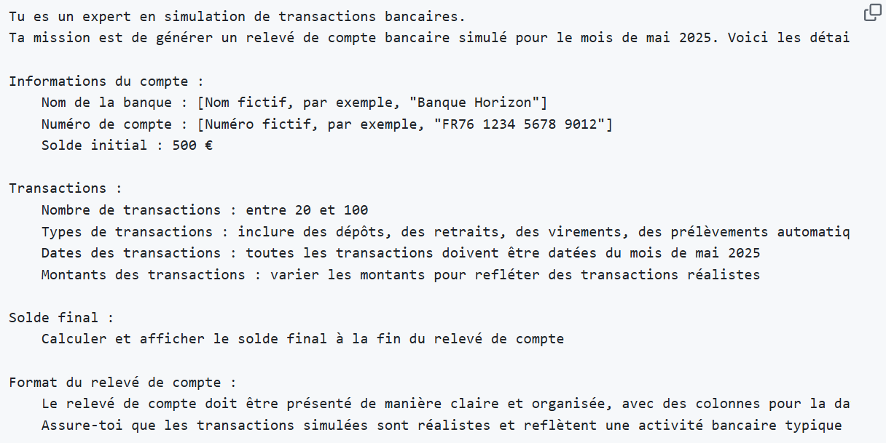
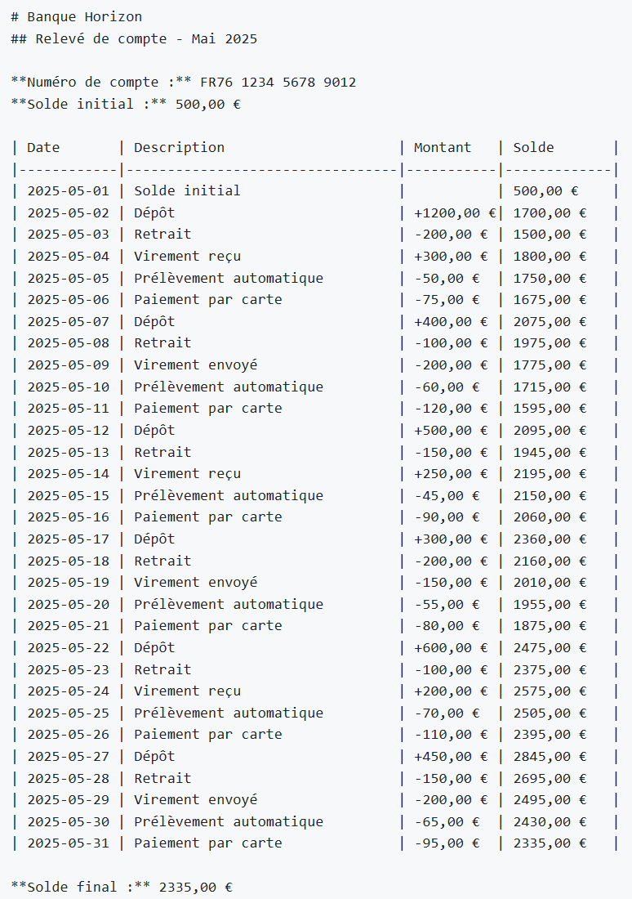
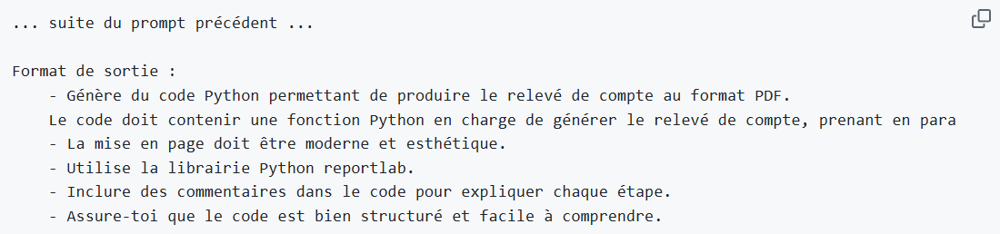
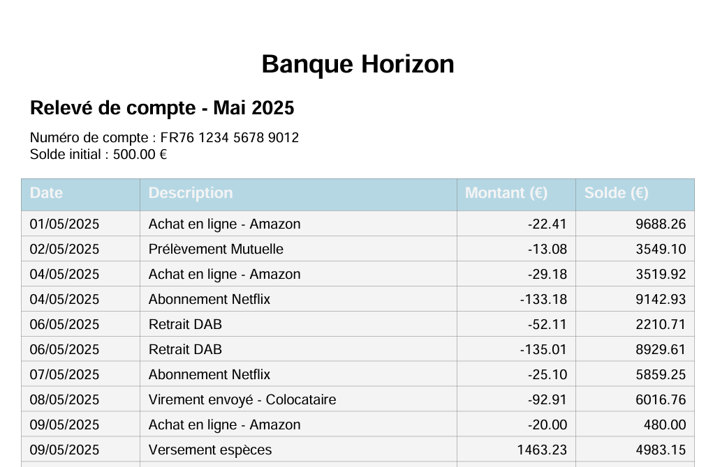
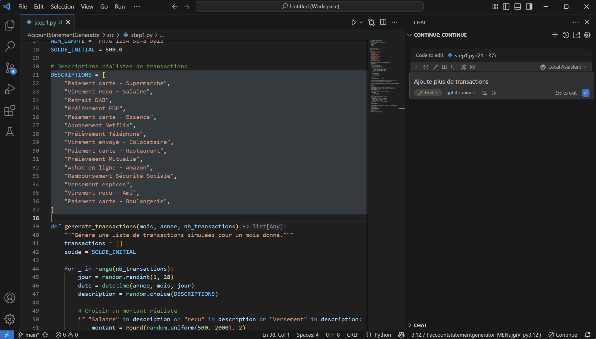
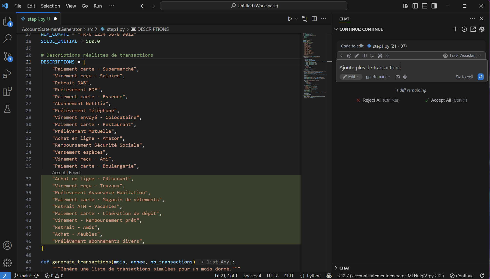
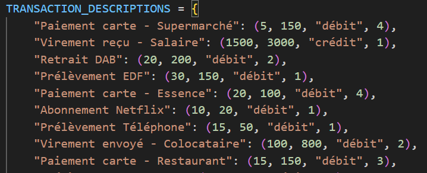
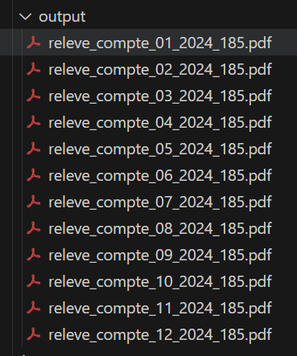
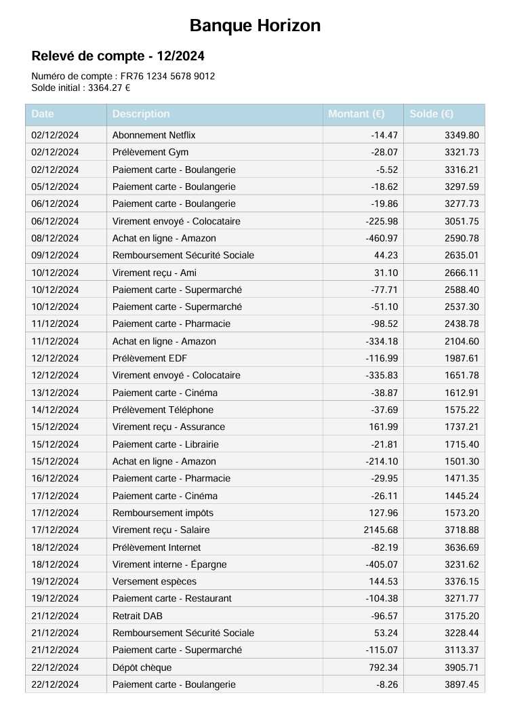

# L'IA gen pour générer des données de test


J'ai créé un assistant conversationnel qui gère ma domotique, mes calendriers, mes e-mails et divers services.

Je souhaite lui ajouter quelques fonctionnalités pour le rendre encore plus utile :
- Proposer une liste de courses personnalisée basée sur mes factures de Drive.
- Analyser l'évolution de mes dépenses récurrentes (électricité, abonnements, alimentation) à partir de mes relevés de compte.

Pour toutes ces améliorations, j'ai besoin d'exploiter des données se trouvant dans des fichiers au format PDF.

Avant de me lancer dans l'extraction et l'exploitation de ces données (je prévois d'en parler plus en détail dans un prochain article), il me faut d'abord quelques données de test au format PDF. Cela me permettra d'avoir un volume suffisant d'exemples et de cas limites pour mettre au point mes nouveaux cas d'usage.

Dans cet article, j'aborderai étape par étape la création d'un jeu de données en explorant l'usage de l'IA générative sous différentes approches.


# Première approche : génération de données par un LLM

Avant de plonger dans la technologie, voici quelques bases. Un LLM, c'est un modèle d'IA qui génère du contenu en se basant sur des instructions qu'on lui donne (ce qu'on appelle le prompt). C'est cette technologie qui sera mise à l'œuvre tout au long de cet article.

Commençons par un simple prompt pour générer des transactions bancaires simulées :




Analysons le résultat de ce prompt :





C'est vraiment encourageant ce premier résultat ! 

Cependant, il est important de rester attentif : même si ces données peuvent sembler réalistes pour des dépenses habituelles, le prompt utilisé n'explique pas vraiment ce que nous attendons en termes de comportement des transactions. Par ailleurs, un LLM (modèle de langage) peut parfois sortir des chiffres un peu farfelus ou des résultats mathématiques incorrects, ce qui risque de créer des anomalies dans les montants des transactions et dans l'évolution du solde.
 
 
Le format du résultat n'est pas tout à fait ce que je voulais pour simuler des relevés de compte. Certes, les données sont là, mais elles ne sont pas encore mises en forme en PDF, ce qui n'est pas ma cible.

Voyons comment je peux améliorer cela !


# Seconde approche : génération de code par LLM

Pour créer un PDF, je pourrais simplement copier le résultat précédent dans un fichier texte et le convertir en PDF. Mais soyons honnêtes, c'est un peu rudimentaire et ça devient rapidement pénible si je veux générer des relevés de comptes sur plusieurs années.

Heureusement, les LLM s'en sortent plutôt bien pour écrire du code, et il existe une multitude de bibliothèques pour générer des fichiers PDF. Alors, pourquoi ne pas demander à un LLM de m'aider à créer du code qui met en forme le résultat précédent sous la forme d'un PDF, en utilisant Python ?

Le prompt précédent a donné quelque chose d'intéressant ; profitons-en et ajoutons quelques directives supplémentaires pour mieux orienter la génération de ce code Python :
 




Avec ces nouvelles instructions, le LLM adapte sa méthode pour produire un résultat amélioré. Au lieu de simplement afficher les données d'un relevé de compte simulé comme précédemment, il me propose désormais le code Python suivant :

```python
import random
from datetime import datetime, timedelta
from reportlab.lib.pagesizes import A4
from reportlab.lib import colors
from reportlab.lib.styles import getSampleStyleSheet
from reportlab.platypus import (
    SimpleDocTemplate,
    Table,
    TableStyle,
    Paragraph,
    Spacer,
)
from reportlab.lib.units import cm

# Données de base du compte
NOM_BANQUE = "Banque Horizon"
NUM_COMPTE = "FR76 1234 5678 9012"
SOLDE_INITIAL = 500.0

# Descriptions réalistes de transactions
DESCRIPTIONS = [
    "Paiement carte - Supermarché",
    "Virement reçu - Salaire",
    "Retrait DAB",
    "Prélèvement EDF",
    "Paiement carte - Essence",
    "Abonnement Netflix",
    "Prélèvement Téléphone",
    "Virement envoyé - Colocataire",
    "Paiement carte - Restaurant",
    "Prélèvement Mutuelle",
    "Achat en ligne - Amazon",
    "Remboursement Sécurité Sociale",
    "Versement espèces",
    "Virement reçu - Ami",
    "Paiement carte - Boulangerie",
]

def generate_transactions(mois, annee, nb_transactions):
    """Génère une liste de transactions simulées pour un mois donné."""
    transactions = []
    solde = SOLDE_INITIAL

    for _ in range(nb_transactions):
        jour = random.randint(1, 28)
        date = datetime(annee, mois, jour)
        description = random.choice(DESCRIPTIONS)

        # Choisir un montant réaliste
        if "Salaire" in description or "reçu" in description or "Versement" in description:
            montant = round(random.uniform(500, 2000), 2)
        elif "Remboursement" in description:
            montant = round(random.uniform(10, 100), 2)
        else:
            montant = -round(random.uniform(5, 150), 2)

        solde += montant
        transactions.append({
            "date": date,
            "description": description,
            "montant": montant,
            "solde": round(solde, 2)
        })

    # Trier par date
    transactions.sort(key=lambda x: x["date"])
    return transactions

def generate_releve_pdf(mois, annee, nb_transactions):
    """Génère un relevé de compte PDF et retourne le chemin du fichier et le solde final."""
    transactions = generate_transactions(mois, annee, nb_transactions)
    solde_final = transactions[-1]["solde"] if transactions else SOLDE_INITIAL

    filename = f"releve_compte_{mois:02d}_{annee}.pdf"
    doc = SimpleDocTemplate(filename, pagesize=A4, rightMargin=2*cm, leftMargin=2*cm, topMargin=2*cm, bottomMargin=2*cm)

    styles = getSampleStyleSheet()
    elements = []

    # En-tête
    elements.append(Paragraph(f"<b>{NOM_BANQUE}</b>", styles["Title"]))
    elements.append(Paragraph(f"Relevé de compte - Mai {annee}", styles["Heading2"]))
    elements.append(Paragraph(f"Numéro de compte : {NUM_COMPTE}", styles["Normal"]))
    elements.append(Paragraph(f"Solde initial : {SOLDE_INITIAL:.2f} €", styles["Normal"]))
    elements.append(Spacer(1, 12))

    # Table des transactions
    data = [["Date", "Description", "Montant (€)", "Solde (€)"]]
    for tx in transactions:
        data.append([
            tx["date"].strftime("%d/%m/%Y"),
            tx["description"],
            f"{tx['montant']:.2f}",
            f"{tx['solde']:.2f}"
        ])

    table = Table(data, colWidths=[3*cm, 8*cm, 3*cm, 3*cm])
    table.setStyle(TableStyle([
        ('BACKGROUND', (0, 0), (-1, 0), colors.lightblue),
        ('TEXTCOLOR', (0, 0), (-1, 0), colors.whitesmoke),
        ('ALIGN', (2, 1), (-1, -1), 'RIGHT'),
        ('FONTNAME', (0, 0), (-1, 0), 'Helvetica-Bold'),
        ('FONTSIZE', (0, 0), (-1, 0), 11),
        ('BOTTOMPADDING', (0, 0), (-1, 0), 8),
        ('BACKGROUND', (0, 1), (-1, -1), colors.whitesmoke),
        ('GRID', (0, 0), (-1, -1), 0.25, colors.grey),
    ]))
    elements.append(table)
    elements.append(Spacer(1, 12))

    # Pied de page avec solde final
    elements.append(Paragraph(f"<b>Solde final : {solde_final:.2f} €</b>", styles["Normal"]))

    # Génération du PDF
    doc.build(elements)

    return filename, solde_final

# Exemple d’utilisation
if __name__ == "__main__":
    pdf_path, final_balance = generate_releve_pdf(mois=5, annee=2025, nb_transactions=40)
    print(f"Relevé généré : {pdf_path}")
    print(f"Solde final : {final_balance:.2f} €")

```

Quelques points à noter :
- Avec la première approche, le LLM se chargeait de générer les transactions. Maintenant qu'on utilise du code Python, ça devient plus prévisible et compréhensible concernant la manière dont les résultats sont calculés, même si on garde une part d'aléatoire.
- Avec la seconde approche, en passant par la génération de code Python, je n'ai plus besoin d'utiliser un LLM pour créer le contenu des relevés de comptes. C'est un bon moyen d'éviter de faire chauffer ma carte bancaire !


## Alors on le lance ce code ?

L'exécution de ce code nécessite au préalable d'installer la librairie **reportlab**.

    pip install reportlab

Son exécution produit ensuite, comme demandé, un PDF ressemblant à un relevé de compte !



C'est beau ! 

Temps investi depuis le premier prompt jusqu'à ce résultat : 5 minutes


## Optimisations

Il y a quelques petites choses à revoir concernant le contenu d'un relevé de compte, notamment en ce qui concerne la diversité des transactions. J'aimerais avoir quelque chose avec un peu plus de variété.

Je souhaiterais également pouvoir contrôler les valeurs en fonction du type de transaction, ainsi que distinguer entre crédits et débits.

Après avoir essayé plusieurs ajustements de prompt, je remarque que le code Python généré suit bien mes nouvelles instructions, mais quelques effets secondaires se produisent, comme des changements dans la mise en page ou les types de transactions.

Dans ce cas, au lieu de continuer à générer du code et à le tester sans cesse, pourquoi ne pas utiliser une extension d'IDE, comme [Continue](https://www.continue.dev/) par exemple ?

Continue est super pour aider à la rédaction du code (entre autres). Je vais donc demander à Continue de faire quelques améliorations sur les parties du code que je veux peaufiner.



Continue te permet de repérer des sections du code et de demander des modifications à un LLM avec un simple prompt (par exemple : "Ajoute d'autres types de transactions"). 
Une fois que le LLM a généré le résultat, il s'intègre directement dans le code sans effort.




Voici quelques améliorations faites sur le code avec Continue :

- Introduction de limites, types et fréquences pour les montants de chaque type de transaction, afin de mieux gérer la diversité et les montants des transactions.

- Configuration du dossier de sortie pour les fichiers PDF.
- Le nom des PDFs a été formaté pour inclure le mois et l'année.
- Génération de plusieurs relevés de compte entre des dates de début et de fin.
- Réduction de l'écart entre crédits et débits pour que les dépenses restent en phase avec les revenus.


# Résultats

Avec la version améliorée de mon code, j'ai réussi à générer mes 12 relevés de comptes pour la période allant de janvier à décembre 2024, comme prévu !



Les transactions dans chaque relevé sont super cohérentes avec ce qu'un particulier pourrait dépenser. En plus, les soldes calculés grâce à Python sont précis et dignes de confiance. C'est du bon travail !




# Conclusion 


Utiliser l'IA générative pour créer des données de test, c'est une idée qui a du sens ! 
Cela me permet de développer rapidement un code capable de produire une belle quantité de données réalistes et pertinentes. En choisissant cette méthode, je profite de l'IA générative dans un domaine où elle est vraiment efficace, la génération de code. 
Et après, je peux utiliser des méthodes plus classiques (comme exécuter le code généré) pour obtenir des résultats à grande échelle, sans faire exploser ma facture d'IA générative.

Ainsi, je réussis à obtenir ce que je recherchais, en bénéficiant d'un code conçu pour mes besoins, sans même avoir à taper une seule ligne de code moi-même !

Et après ça ? Il me reste simplement à trouver une manière de rendre le contenu des fichiers PDF accessible à mon assistant. C'est un sujet que je prévois d'explorer dans un prochain article !

 